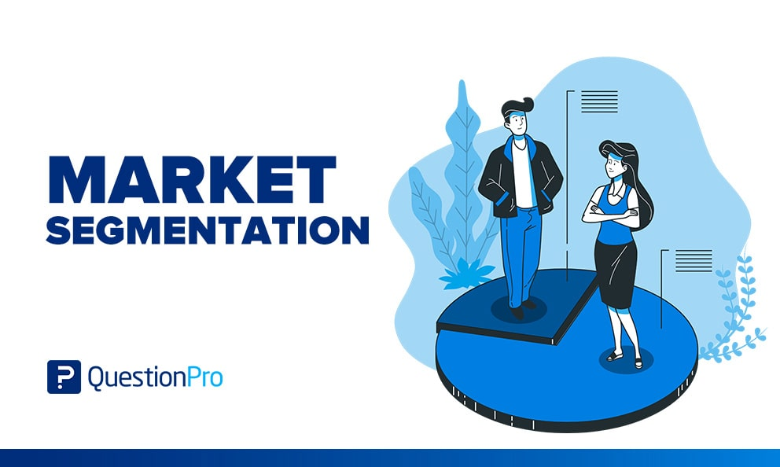

# MarketSegmentation

 
  
<h1 align="center"> MarketSegmentation  </h1> 

     

 

<h3 align="center"> Fenny Labs verified Project 

<h2> :book:Introduction</h2>
It is essential for any businesses to understand their customers behaviour. Through that understanding, a business is able to effectively provide solutions for customers as products/services. Many businesses leverage this knowledge to gain an edge over the competition and try to come up with better offers to customers.

 <h2> :book:Problem Statements</h2>
Markets are now saturated with the sheer amount of companies that provide similar products & services. Competition is is tighter than it was in the past because of the reach that technology has provided companies. This exasperates the importance of customer understanding.

<h2> :book:Data Description</h2>
  
BALANCE : Balance amount left in customers account to make purchases
  
BALANCE_FREQUENCY : How frequently the Balance is updated, score between 0 and 1

PURCHASES : Amount of purchases made from account
  
ONEOFF_PURCHASES : Maximum purchase amount done in one-go

INSTALLMENTS_PURCHASES : Amount of purchase done in installment

CASH_ADVANCE : Cash in advance given by the user

  PURCHASES_FREQUENCY : How frequently the Purchases are being made, score between 0 and 1

  ONEOFFPURCHASESFREQUENCY : How frequently Purchases are happening in one-go

  PURCHASESINSTALLMENTSFREQUENCY : How frequently purchases in installments are being done

  CASHADVANCEFREQUENCY : How frequently the cash in advance being paid

  CASHADVANCETRX : Number of Transactions made with "Cash in Advanced"

  PURCHASES_TRX : Numbe of purchase transactions made

  CREDIT_LIMIT : Limit of Credit Card for user

  PAYMENTS : Amount of Payment done by user

  MINIMUM_PAYMENTS : Minimum amount of payments made by user

  PRCFULLPAYMENT : Percent of full payment paid by user

  TENURE : Tenure of credit card service for user

  (1=frequent, 0=not frequent)

  
<h2> :book: Depoyment on Heroku</h2>

https://sushant8525-marketsegmentation-app-xaasry.streamlit.app/
  
for localhost :-   streamlit run app.py --server.port=80

<h2> :book:Conclusion</h2>
  
Within the domain of Unsupervised Learning, especially in the context of Customer Segmentation, normalizing and standardizing the data will determine how the data will be plotted. Therefore it will determine how the clusters get formed. Along with the scaling methods, the modeling algorithm will affect clustering as well. Unsupervised learning finds patterns within unlabelled data.

